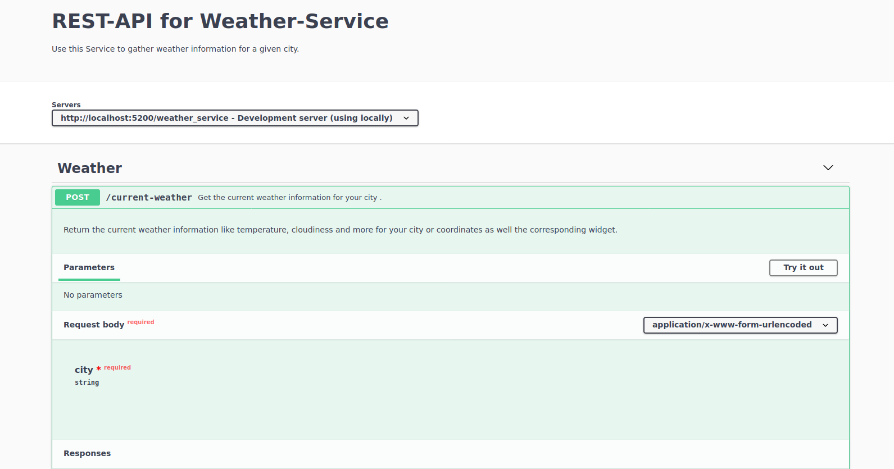
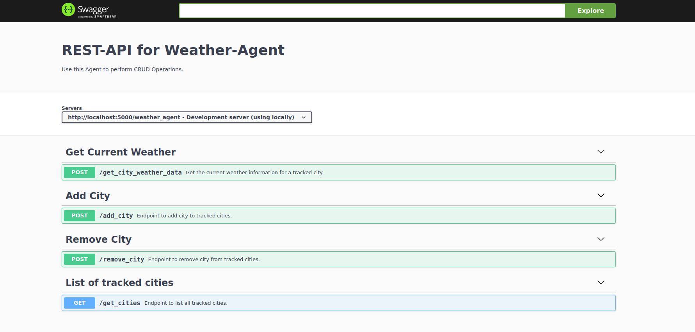

# Weather Tracking System

## Implemented:

- Weather Agent API:
  - Weather Agent  CRUD endpoints with access to mongoDB
  - Weather Agent get city last weather data endpoint
  - Schedule daily background tasks for daily data collection
- Weather Service API:
  - Current Data Collection from OpenWeatherMap
  - OpenAPI (Swagger) specification support
  - Caching OpenWeatherMap API responses with Redis backend
  - Docker Image
  - Tests

## ToDOs

* Weather Agent API:
  * Tests
  * Docker image

* Weather Service API:
  * API internalization
* MongoDB as a Docker Container

## Run System

For the present moment we need to have a running mongoDB  instance on your machine and a virtual python environment to support the system's functionality.

### Weather Service API

To launch the Weather Service API go to the weather_service sub-directory and run server.py. You can go to http://localhost:5200/weather_service to inspect the API's functionality.

OR

Being in the weather_service directory , build a docker image by executing the following commands: 

```bash
$ docker-compose build
$ docker-compose up -d
```

Then head to http://172.18.0.3:5200/ to inspect the API's functionality.




### Weather Agent API

To launch the Weather Agent API go to the weather_agent sub-dir and run server.py. Currently OpenAPI is not supported, instead you can check CRUD functionality by issuing the following commands:

To add a city to city watch list:

```bash
curl -i "localhost:5000/weather_agent/add_city" -d "city"="London"
```

To remove a city from watch list:

```bash
curl -i "localhost:5000/weather_agent/delete_city" -d "city"="London"
```

To get a list of tracked cities:

```bash
curl -i "localhost:5000/weather_agent/get_cities'" -d "city"="London"
```

To get city's last weather data:

```bash
curl -i "localhost:5000/weather_agent/get_city_weather_data" -d "city"="London"
```



### MongoDB collections instances 


